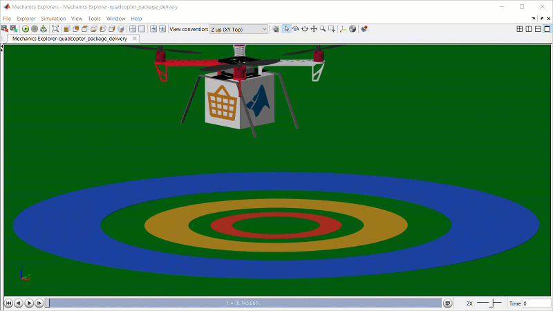
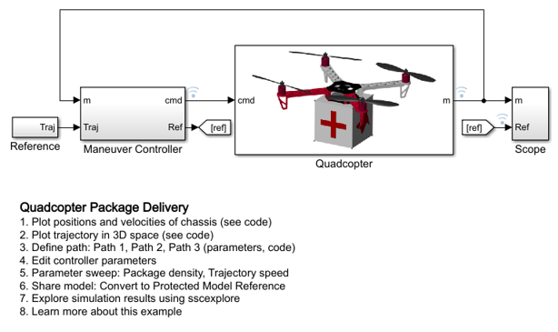
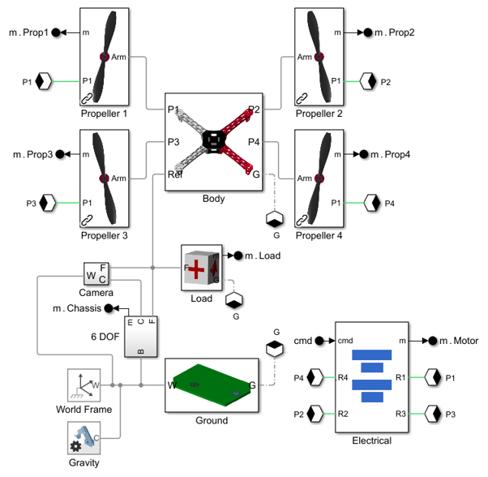
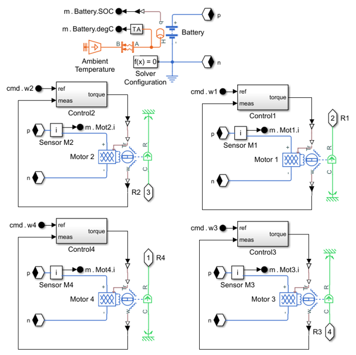

# **Quadcopter Drone Model in Simscape**
Copyright 2021 The MathWorks, Inc.

This example models a quadcopter that navigates a path to deliver a package. The body 
was designed in CAD and imported into Simscape Multibody. The electric motors capture 
the dynamics of the power conversion in an abstract manner to enable fast simulation. 
The package is released from the quadcopter when it reaches the final waypoint and 
the release criteria are met.

Open the project file Quadcopter_Drone.prj to get started.

## **Quadcopter and Control System**

## **Quadcopter Mechanical and Electrical Systems**

## **Quadcopter Motors and Battery**

To learn more about modeling and simulation with Simscape, please visit:
* [Simscape Getting Started Resources](https://www.mathworks.com/solutions/physical-modeling/resources.html)
* Product Capabilities:
   * [Simscape](https://www.mathworks.com/products/simscape.html)
   * [Simscape Driveline](https://www.mathworks.com/products/simscape-driveline.html)
   * [Simscape Electrical](https://www.mathworks.com/products/simscape-electrical.html)
   * [Simscape Fluids](https://www.mathworks.com/products/simscape-fluids.html)
   * [Simscape Multibody](https://www.mathworks.com/products/simscape-multibody.html)

